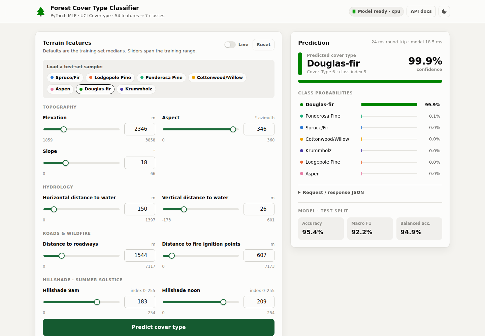
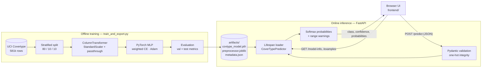
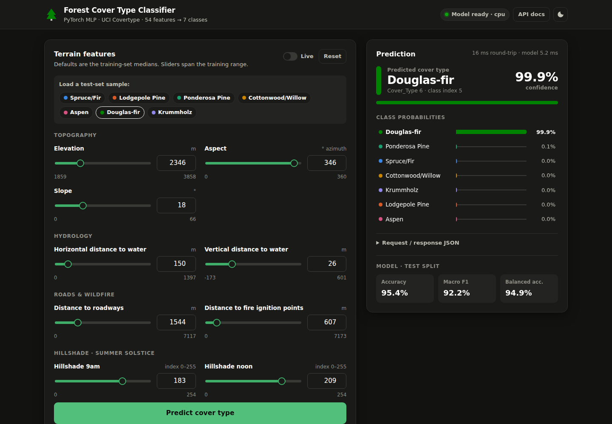

<div align="center">

# 🌲 Forest Cover Type Classifier

**End-to-end deep learning system that predicts the forest cover type of a 30 m × 30 m land cell from cartographic data — from PyTorch training to a production-style FastAPI service and an interactive web UI.**

[](https://github.com/evez12/forest-cover-type-classifier/actions/workflows/ci.yml)
[](https://huggingface.co/spaces/evez12/forest-cover-type-classifier)
[](https://www.python.org/)
[](https://pytorch.org/)
[](https://scikit-learn.org/)
[](https://fastapi.tiangolo.com/)
[](Dockerfile)
[](LICENSE)

### [▶ Try the live demo](https://evez12-forest-cover-type-classifier.hf.space)

**Test accuracy 95.4 %** · **Macro F1 0.922** · **MCC 0.926** · 58,102 held-out samples



</div>

---

## Table of Contents

- [Overview](#overview)
- [Results](#results)
- [System Architecture](#system-architecture)
- [Dataset Details](#dataset-details)
- [Model](#model)
- [Project Structure](#project-structure)
- [Getting Started](#getting-started)
- [Deployment](#deployment)
- [API Endpoints](#api-endpoints)
- [Screenshots & Usage](#screenshots--usage)
- [Testing](#testing)
- [Future Improvements](#future-improvements)
- [License](#license)

---

## Overview

Forest managers need to know which tree species dominate a given area, but surveying every hectare in the field is expensive. The **Forest Cover Type** problem asks whether the dominant cover type can be inferred from cheap, remotely derived cartographic variables alone — elevation, slope, distances to water, roads and fire points, hillshade indices, wilderness area and soil type.

This project solves it as a **7-class tabular classification** task with a **deep multilayer perceptron in PyTorch** and ships the model as a complete application:

| Layer | What it does |
|---|---|
| **Model** (`covtype/`, `train_and_export.py`) | Reproducible training pipeline: stratified 80/10/10 split, `ColumnTransformer` preprocessing, class-weighted loss, 6-layer MLP with BatchNorm. Exports weights, the fitted preprocessor and rich metadata. |
| **Backend** (`backend/`) | FastAPI inference service with strict Pydantic validation (one-hot integrity checks), batch inference, out-of-distribution warnings, health/model-info endpoints and auto-generated OpenAPI docs. |
| **Frontend** (`frontend/`) | Dependency-free HTML/CSS/JS single-page app: sliders bounded by training ranges, one-click test-set presets, live prediction mode, probability bars, light/dark theme. |
| **Research** (`notebooks/`) | Full evaluation notebook: learning curves, generalization gap, confusion matrix, per-class metrics, ROC / PR curves and calibration (reliability diagram, ECE). |

---

## Results

Evaluated on the stratified **test split (10 %, 58,102 samples)** that the model never saw during training or model selection.

| Metric | Score |
|---|---|
| Accuracy | **0.9535** |
| Balanced accuracy | 0.9492 |
| Macro F1 | 0.9218 |
| Weighted F1 | 0.9538 |
| Cohen's κ | 0.9258 |
| Matthews corr. coef. | 0.9259 |

<details>
<summary><b>Per-class metrics (test split)</b></summary>

| Cover type | Precision | Recall | F1 | Support |
|---|---|---|---|---|
| 1 · Spruce/Fir | 0.954 | 0.954 | 0.954 | 21,184 |
| 2 · Lodgepole Pine | 0.968 | 0.954 | 0.961 | 28,331 |
| 3 · Ponderosa Pine | 0.949 | 0.949 | 0.949 | 3,576 |
| 4 · Cottonwood/Willow | 0.814 | 0.927 | 0.867 | 274 |
| 5 · Aspen | 0.790 | 0.953 | 0.863 | 949 |
| 6 · Douglas-fir | 0.880 | 0.937 | 0.908 | 1,737 |
| 7 · Krummholz | 0.930 | 0.971 | 0.950 | 2,051 |

</details>

The class-weighted loss deliberately trades a little precision on the rare classes (Cottonwood/Willow, Aspen) for **recall ≥ 0.93 on every class**, which is why balanced accuracy stays close to plain accuracy despite a ~100:1 class imbalance.

---

## System Architecture



**Request lifecycle**

1. **Startup** — the FastAPI `lifespan` hook loads the `state_dict`, the fitted `ColumnTransformer` and `metadata.json` once. If artifacts are missing the server stays up and `/health` reports `degraded` instead of crashing.
2. **Validation** — the request body is validated against a 54-field Pydantic schema: physical bounds on numeric features, binary one-hot fields, exactly one active `Wilderness_Area_*` and one `Soil_Type_*`, and unknown fields rejected (`422`).
3. **Inference** — raw features → `DataFrame` in training column order → the *same* fitted preprocessor used in training → `float32` tensor → model in `eval()` mode (BatchNorm uses running statistics) under `torch.inference_mode()` → softmax.
4. **Response** — predicted class, confidence, the full ranked distribution, latency, and warnings for any numeric input that lies outside the training range (extrapolation).
5. **Frontend** — served by FastAPI from the same origin; it bootstraps its form from `/model-info` (feature ranges, class colors) and `/examples` (one correctly classified test row per class).

Route handlers are synchronous `def` functions, so CPU-bound inference runs in Starlette's threadpool and never blocks the event loop.

---

## Dataset Details

**Source:** [UCI Covertype](https://archive.ics.uci.edu/dataset/31/covertype) (Blackard & Dean, 1998) — Roosevelt National Forest, northern Colorado. Loaded via `sklearn.datasets.fetch_covtype`, so no manual download is needed.

| Property | Value |
|---|---|
| Samples | 581,012 cells (30 m × 30 m) |
| Features | 54 (10 continuous + 4 wilderness one-hot + 40 soil one-hot) |
| Target | `Cover_Type` ∈ {1…7}, remapped to class index 0…6 |
| Missing values | None |

**Features**

| Group | Features | Preprocessing |
|---|---|---|
| Topography | `Elevation` (m), `Aspect` (° azimuth), `Slope` (°) | `StandardScaler` |
| Hydrology | `Horizontal_Distance_To_Hydrology`, `Vertical_Distance_To_Hydrology` (m) | `StandardScaler` |
| Human impact | `Horizontal_Distance_To_Roadways`, `Horizontal_Distance_To_Fire_Points` (m) | `StandardScaler` |
| Illumination | `Hillshade_9am`, `Hillshade_Noon`, `Hillshade_3pm` (0–255, summer solstice) | `StandardScaler` |
| Wilderness area | `Wilderness_Area_0…3` (Rawah, Neota, Comanche Peak, Cache la Poudre) | passthrough |
| Soil type | `Soil_Type_0…39` (USFS ELU codes) | passthrough |

**Class distribution** — highly imbalanced:

| Cover type | Samples | Share |
|---|---|---|
| Lodgepole Pine | 283,301 | 48.8 % |
| Spruce/Fir | 211,840 | 36.5 % |
| Ponderosa Pine | 35,754 | 6.2 % |
| Krummholz | 20,510 | 3.5 % |
| Douglas-fir | 17,367 | 3.0 % |
| Aspen | 9,493 | 1.6 % |
| Cottonwood/Willow | 2,747 | 0.5 % |

**Preprocessing pipeline**

1. Target shift `Cover_Type − 1` → class indices 0…6 (inverse mapping stored in `metadata.json`).
2. Stratified split **80 / 10 / 10** (train / validation / test), `random_state=11`.
3. `ColumnTransformer`: `StandardScaler` on the 10 continuous features, passthrough on the 44 one-hot features — **fit on the training split only** to avoid leakage, then persisted with `joblib` and reused verbatim at inference time.
4. **Class weights** `w_c = 1 / √n_c`, normalized to mean 1 — a softened inverse-frequency scheme that boosts rare classes without destabilizing training.

---

## Model

`CoverTypeClassifier` — a deep MLP with Batch Normalization after every linear layer:

```
Input (54) → [Linear → BatchNorm → ReLU] × 5 (128 → 128 → 128 → 64 → 32) → Linear (7) → BatchNorm → logits
```

| Hyperparameter | Value |
|---|---|
| Loss | Class-weighted `CrossEntropyLoss` |
| Optimizer | Adam, lr = 1e-3 |
| Batch size | 1024 |
| Epochs | 100 (last-epoch weights; `--restore-best` exports the best-validation-loss epoch) |
| Seed | 11 (`torch.manual_seed`, split `random_state`) |
| Parameters | ~46k |

Training keeps the full dataset on the GPU and shuffles with on-device index permutations, avoiding `DataLoader` overhead for this in-memory tabular workload.

> **Note on probabilities:** because the loss is class-weighted, the softmax outputs are shifted toward minority classes and are not calibrated. See the reliability diagram in the notebook before using them as true probabilities.

---

## Project Structure

```
forest-cover-type-classifier/
├── covtype/                         # Shared ML package (used by training AND serving)
│   ├── __init__.py
│   ├── constants.py                 # Feature order, class names/colors, soil & wilderness labels
│   └── model.py                     # CoverTypeClassifier (PyTorch nn.Module)
├── backend/                         # FastAPI inference service
│   ├── __init__.py
│   ├── config.py                    # Environment-based settings (COVTYPE_*)
│   ├── schemas.py                   # Pydantic request/response models + one-hot validation
│   ├── predictor.py                 # Artifact loading and inference pipeline
│   └── main.py                      # App factory, routes, CORS, static frontend
├── frontend/                        # Framework-free web UI (served by FastAPI)
│   ├── index.html
│   ├── styles.css
│   └── app.js
├── artifacts/                       # Exported inference artifacts (versioned, ~260 KB)
│   ├── covtype_model.pth            # Model state_dict
│   ├── preprocessor.joblib          # Fitted ColumnTransformer
│   └── metadata.json                # Label map, feature stats, config, metrics, UI presets
├── notebooks/
│   └── covtype_training_and_evaluation.ipynb   # EDA, training and full evaluation report
├── tests/
│   ├── conftest.py                  # TestClient fixture (runs the app lifespan)
│   ├── test_api.py                  # API integration tests
│   ├── test_model.py                # Model unit tests
│   └── api_requests.http            # Manual requests (PyCharm / VS Code REST Client)
├── docs/screenshots/                # README images
├── .github/workflows/
│   ├── ci.yml                       # Lint + tests + Docker build
│   └── deploy.yml                   # Auto-deploy to Hugging Face Spaces
├── scripts/
│   └── deploy_hf_space.py           # Builds the Space bundle and uploads it
├── train_and_export.py              # Training CLI → artifacts/
├── Dockerfile                       # CPU inference image
├── pyproject.toml                   # Project metadata, pytest & ruff config
├── requirements.txt                 # Full environment (CUDA 12.8 PyTorch, notebook)
├── requirements-api.txt             # Minimal serving dependencies
├── requirements-dev.txt             # Serving + test/lint tooling
└── LICENSE
```

---

## Getting Started

### Prerequisites

- Python **3.12+** (developed on 3.14, CI on 3.13)
- Optional: NVIDIA GPU with CUDA 12.8 for training
- Optional: Docker

### 1. Clone the repository

```bash
git clone https://github.com/evez12/forest-cover-type-classifier.git
cd forest-cover-type-classifier
```

### 2. Create a virtual environment

```bash
python -m venv .venv

# Linux / macOS
source .venv/bin/activate
# Windows (PowerShell)
.\.venv\Scripts\Activate.ps1
```

### 3. Install dependencies

Pick the profile you need:

```bash
# a) Full environment — training on GPU (CUDA 12.8) + notebook
pip install -r requirements.txt

# b) Serving / development only — CPU PyTorch, much smaller download
pip install torch==2.11.0 --index-url https://download.pytorch.org/whl/cpu
pip install -r requirements-dev.txt
```

> For CPU-only training with profile (a), remove the `--extra-index-url` line and the `+cu128` suffix from `requirements.txt`.

### 4. (Optional) Retrain the model

Pre-trained artifacts are already included in `artifacts/`, so this step is optional.

```bash
python train_and_export.py                   # 100 epochs, last-epoch weights (reproduces the notebook)
python train_and_export.py --restore-best    # export best-validation-loss weights instead
python train_and_export.py --epochs 5        # quick smoke run
```

Options: `--epochs`, `--batch-size`, `--lr`, `--seed`, `--device auto|cpu|cuda`, `--output-dir`. The first run downloads the dataset (~11 MB) to `~/scikit_learn_data`.

### 5. Run the application

```bash
uvicorn backend.main:app --reload
```

| URL | Description |
|---|---|
| <http://127.0.0.1:8000/> | Web UI |
| <http://127.0.0.1:8000/docs> | Swagger UI (interactive API docs) |
| <http://127.0.0.1:8000/redoc> | ReDoc |

### Run with Docker

```bash
docker build -t covtype-api .
docker run --rm -p 8000:8000 covtype-api
```

The image uses CPU-only PyTorch, runs as a non-root user and defines a `HEALTHCHECK` against `/health`.

### Configuration

All settings are optional environment variables:

| Variable | Default | Description |
|---|---|---|
| `COVTYPE_ARTIFACTS_DIR` | `./artifacts` | Directory containing `.pth`, `.joblib` and `.json` artifacts |
| `COVTYPE_FRONTEND_DIR` | `./frontend` | Static frontend directory |
| `COVTYPE_DEVICE` | `cpu` | `cpu`, `cuda`, or `auto` |
| `COVTYPE_CORS_ORIGINS` | `*` | Comma-separated list of allowed origins |
| `COVTYPE_MAX_BATCH_SIZE` | `10000` | Maximum instances per `/predict/batch` request |

---

## Deployment

The app is deployed for free on **[Hugging Face Spaces](https://huggingface.co/spaces/evez12/forest-cover-type-classifier)** (Docker SDK, CPU tier) and redeployed automatically on every push to `main`:

```
git push → CI (lint + tests + Docker build) → deploy.yml → scripts/deploy_hf_space.py → Space rebuilds the Docker image
```

| URL | |
|---|---|
| <https://evez12-forest-cover-type-classifier.hf.space/> | Web UI |
| <https://evez12-forest-cover-type-classifier.hf.space/docs> | Swagger UI |
| <https://huggingface.co/spaces/evez12/forest-cover-type-classifier> | Space page |

**One-time setup (fork / own account)**

1. Create a free account at [huggingface.co](https://huggingface.co/join).
2. Create an access token with **Write** permission: *Settings → Access Tokens*.
3. In the GitHub repo: *Settings → Secrets and variables → Actions → New repository secret* → name `HF_TOKEN`.
4. Push to `main` or run **Deploy to Hugging Face Spaces** from the *Actions* tab. The Space `<hf-username>/forest-cover-type-classifier` is created on the first run (override with the `HF_SPACE_ID` repository variable).

Manual deploy: `HF_TOKEN=hf_xxx python scripts/deploy_hf_space.py` (`--dry-run` lists the bundle without uploading).

> Free Spaces sleep after 48 h without traffic; the first visit afterwards takes ~1 minute to wake up.

---

## API Endpoints

| Method | Path | Description |
|---|---|---|
| `GET` | `/health` | Liveness and model status (`ok` / `degraded`), inference device |
| `GET` | `/model-info` | Architecture, class labels & colors, training feature statistics, test metrics |
| `GET` | `/examples` | One representative, correctly classified test-set row per class |
| `POST` | `/predict` | Single prediction |
| `POST` | `/predict/batch` | Batch prediction — `{"instances": [...]}` |
| `GET` | `/docs` | Swagger UI |

### `POST /predict`

Field names are the 54 original dataset columns. One-hot fields default to `0`, so a client only needs to send the active wilderness area and soil type.

```bash
curl -X POST http://127.0.0.1:8000/predict \
  -H "Content-Type: application/json" \
  -d '{
        "Elevation": 2596, "Aspect": 51, "Slope": 3,
        "Horizontal_Distance_To_Hydrology": 258, "Vertical_Distance_To_Hydrology": 0,
        "Horizontal_Distance_To_Roadways": 510,
        "Hillshade_9am": 221, "Hillshade_Noon": 232, "Hillshade_3pm": 148,
        "Horizontal_Distance_To_Fire_Points": 6279,
        "Wilderness_Area_0": 1, "Soil_Type_28": 1
      }'
```

**Response** (values illustrative)

```json
{
  "class_index": 4,
  "cover_type": 5,
  "class_name": "Aspen",
  "confidence": 0.93,
  "probabilities": [
    {"class_index": 4, "cover_type": 5, "class_name": "Aspen", "probability": 0.93},
    {"class_index": 1, "cover_type": 2, "class_name": "Lodgepole Pine", "probability": 0.05}
  ],
  "warnings": [],
  "latency_ms": 3.1
}
```

`probabilities` always contains all 7 classes sorted in descending order (truncated above).

### Error handling

| Status | When |
|---|---|
| `422 Unprocessable Entity` | Schema violation — out-of-bounds value, non-binary one-hot value, zero or multiple active `Wilderness_Area_*` / `Soil_Type_*`, unknown field |
| `413 Content Too Large` | Batch exceeds `COVTYPE_MAX_BATCH_SIZE` |
| `503 Service Unavailable` | Model artifacts failed to load |

Ready-made requests for every endpoint, including failure cases, are in [`tests/api_requests.http`](tests/api_requests.http).

---

## Screenshots & Usage

| Light theme | Dark theme |
|---|---|
|  |  |

**How to use the web UI**

1. Start the server and open <http://127.0.0.1:8000/>. The status pill turns green once the model is loaded.
2. Adjust the terrain features — every slider is bounded by the training-set range and defaults to the training median.
3. Pick a **wilderness area** and a **soil type** (USFS ELU code with description).
4. Click **Predict cover type**, or enable **Live** to re-predict on every change.
5. Or click one of the **test-set sample** chips to load a real, correctly classified example of each class.
6. Inspect the ranked class probabilities, extrapolation warnings, and the raw request/response JSON.

---

## Testing

```bash
pytest          # 15 tests: API integration + model unit tests
ruff check .    # linting
```

The test suite runs the real FastAPI app (including its lifespan) against the committed artifacts. A key regression test predicts every `/examples` preset and asserts that it is classified as its true class — this catches any drift between the training and serving preprocessing pipelines. CI runs lint, tests and a Docker build on every push and pull request.

---

## Future Improvements

**Model**
- Benchmark against gradient-boosted trees (LightGBM / XGBoost) and tabular deep-learning architectures (FT-Transformer, TabNet).
- Hyperparameter search with Optuna; early stopping and learning-rate scheduling.
- Post-hoc probability calibration (temperature scaling) to correct the shift introduced by class weighting.
- Feature engineering: Euclidean distance to hydrology, cyclical encoding of `Aspect`.

**Serving & scalability**
- Export to **ONNX / TorchScript** and serve with ONNX Runtime for lower CPU latency.
- Model registry and versioned artifacts (MLflow); expose the model version in responses.
- Prometheus metrics, structured logging and request tracing.
- Input-drift monitoring using the training feature statistics already stored in `metadata.json`.
- API-key authentication and rate limiting for public deployments.

**Engineering**
- Publish the Docker image to GHCR and add a staging environment before the production Space.
- Type checking with `mypy` and pre-commit hooks.
- SHAP-based per-prediction explanations surfaced in the UI.

---

## License

Released under the [MIT License](LICENSE).

**Dataset:** Blackard, J. (1998). *Covertype* [Dataset]. UCI Machine Learning Repository. <https://doi.org/10.24432/C50K5N>

---

<div align="center">

Built by **Avaz Huseynov** · Deep Learning Cohort I 2026, AI Academy

</div>
